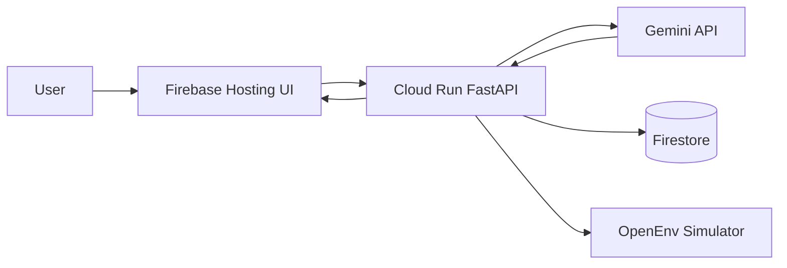

# Architecture

## System Overview

## Components

- Frontend (`prototype/`): Simple form + button + result view.
- API (`server/app.py`): Exposes `/ai/scale-advice` and OpenEnv routes.
- AI Layer (`server/gemini_advisor.py`): Prompting, parsing, fallback logic.
- Logging (`server/event_logger.py`): Optional Firestore event persistence.
- Simulation (`server/cloudscale_rl_environment.py`): Task environments and reward logic.

## Data Flow

1. User enters current infra metrics in frontend.
2. Frontend calls API `POST /ai/scale-advice`.
3. API requests Gemini recommendation.
4. API clamps output to valid action range `[-2, -1, 0, 1, 2]`.
5. API logs request/response to Firestore (if enabled).
6. Frontend displays action + rationale.

## Reliability Design

- Deterministic fallback policy when Gemini/API fails.
- Response schema validation via Pydantic.
- CORS enabled for Firebase-hosted frontend.

## Security Notes

- Do not expose API keys in frontend.
- Pass `GOOGLE_API_KEY` only to backend service environment.
- Restrict Cloud Run IAM and Firebase project access in production.
